

<h1><b>Assessing LLMs to Improve the Prediction of COVID-19 Status Using Microbiome Data</b><h1>

    Team: Sean Chan, Kathleen Nguyen, Carmen Truong and Lorenzo Ramos
     
    Mentor: Rob Knight, Kalen Cantrell and Daniel McDonald

 Reference: Centers for Disease Control and Prevention (CDC) 

 
<h2><b>Abstract</b></h2>

    In this study, we evaluated the performance of four Large Language Models (LLMs)—AAM, DNABERT, DNABERT-2, GROVER—in predicting COVID-19 status from microbiome data. Given the increasing recognition of the microbiome’s role in health outcomes, we focused on how the pre-training of these models impact their predictive capabilities. These four models were chosen for their distinct pre-training strategies: DNABERT and GROVER were trained on the human genome, DNABERT-2 incorporated multi-species genomes and AAM was trained on 16S ribosomal RNA (rRNA) sequencing data. We assessed each model’s performance by using embeddings extracted from various hospital-derived 16S rRNA sequencing data labeled with COVID-19 status ("Positive" or "Not detected") and fed the embeddings through a classifier. For our evaluation metrics, we used AUROC and AUPRC to benchmark. Our results show that AAM, the model pre-trained on 16S rRNA sequencing data, outperformed the other models, achieving the highest AUROC and AUPRC scores overall across the four various hospital-derived sample types. DNABERT-2, also demonstrated strong performance, while DNABERT and GROVER fell short. These findings highlight the significance of pre-training models on domain-specific data, such as 16S rRNA sequences, in order to improve predictability for microbiome-based health outcomes like COVID-19 status. Additionally, the success of DNABERT-2 emphasizes the value of multi-species pre-training for capturing more complex microbial relationships.

 
<h2><b>Introduction</b></h2>

   With the vast amount of data available today, there are plenty of opportunities to harness it for global progress, from generating personalized recommendations to improving communication across languages. This is made possible with the power of Large Language Models (LLMs). A Large Language Model is a type of machine learning model that is trained on large sets of data to learn patterns and relationships among forms of written content via deep neural networks <a href="#Toloka">(Toloka AI 2199)</a>. Originally developed for Natural Language Processing (NLP), LLMs have since expanded into a wide range of sectors, including healthcare.
    
  The COVID-19 pandemic highlighted the importance of data in shaping public health responses and accelerating medical research. The virus was first detected in December 2019 in Wuhan, China when patients experienced symptoms of an atypical pneumonia-like illness from an unknown cause <a href="#CentersforDiseaseControlandPrevention_2024">(Centers for Disease Control and Prevention 2024)</a>. It quickly spread worldwide, causing unprecedented levels of sickness and death. The need for real-time analysis of the virus’s impact and the development of treatments created vast amounts of healthcare data. AI models, including LLMs, played a significant role in analyzing this data during the pandemic, especially in processing scientific literature, summarizing research findings and tracking developments in real time <a href="#Farhat2023">(Farhat et al. 2023)</a>. While LLMs weren’t directly involved in developing predictive models, they assisted medical professionals and researchers by extracting relevant insights from data and providing accessible information to both fields. As a result, LLMs contributed to vaccine development and medical research. Not only were LLMs used to process scientific literature and summarize research findings, they were also involved in predicting COVID-19 status. These models were applied to various types of data, such as text-based descriptions, genomic sequences and even audio recordings. Text-based LLMs, such as BioBERT and PubMedBERT, were used to analyze clinical records, extract medical information and identify patterns linked to COVID-19 diagnosis and patient outcomes. Genomic LLMs, such as GenSLMs, were used to classify and cluster different COVID-19 genome sequences by distinguishing between variants <a href="#zvyagin2023genslms">(Zvyagin et al. (2023))</a>. Additionally, LLMs were employed to analyze speech and audio data, detecting COVID-19-specific vocal biomarkers in coughs or speech patterns  <a href="#anibal2024omicron">(Anibal et al. 2024)</a>. Through these applications, LLMs provided insight and supported the development of predictive models for COVID-19, making a contribution to pandemic response efforts.
    
  Although the public health emergency has ended, COVID-19 continues to affect people globally. The virus remains highly mutative, with new variants likely to emerge, which presents the ongoing challenges of tracking and managing its spread <a href="#Markov2023">(Markov et al. 2023)</a>. However, the many lessons learned from the pandemic continue to drive progress in combating COVID-19 and future health crises. The ability of Large Language Models to track and offer insights into COVID-19 data not only improves our response to the virus, but they also serve as a test case for how LLMs can transform healthcare. By improving models and processing more datasets, LLMs can assist in extracting information from medical content, supporting public health communication and aiding in the development of predictive models for future health crises. Continuing to improve the capabilities of Large Language Models will not only strengthen the ability to predict and manage COVID-19, but also prepare for the broader application of LLMs. LLMs are not just a tool for responding to current issues, but as a means to shape a better, data-driven future in healthcare and beyond.
    
  Our project leveraged the power of Large Language Models, with a focus on pre-trained genomic transformers, to improve the current state of predictive models for COVID-19 diagnostics. We compared the diverse approaches of Attention All Microbes (AAM) <a href="#cantrell2025microbes">(Cantrell 2025)</a>, DNABERT <a href="#ji2021dnabert">(Ji et al. 2021)</a>, DNABERT-2 <a href="#zhou2023dnabert">(Zhou et al. 2023)</a> and GROVER <a href="#sanabria2024dna">(Sanabria et al. 2024)</a> to determine which method most effectively integrates Large Language Models into microbiome-based COVID-19 predictions.  By enhancing both prediction accuracy and feature selection, we determined which method improved diagnostic classification beyond the current state of predictive models, such as Random Forest Classifiers.
    
  At the core of the investigation and comparative framework is the application of Random Forest Classifiers, a machine learning algorithm. When Random Forest was applied to classify microbes associated with COVID-19, it resulted in a high predictive accuracy among each sample of nares, stool, forehead and floor inside the hospital <a href="#Marotz2020">(Marotz et al. 2020)</a>. Beyond the original study and its use of Random Forest Classifiers, we wanted to utilize Large Language Models. Contemporary solutions have increasingly relied on LLMs, which have benefited from extensive pre-training on genomic data and offered its insight in analyzing biological information.
    
  Models like DNABERT and GROVER both adapted the transformer architecture from Bidirectional Encoder Representations from Transformers (BERT) <a href="#devlin2018bert">(Devlin et al. (2018))</a>. In addition to BERT's abilities, DNABERT and GROVER have been specifically designed to interpret biological sequences. DNABERT, for instance, focuses on DNA sequence data and is effective at predicting disease-associated genetic variants. GROVER is optimized to process both DNA and RNA sequences, allowing for the simultaneous analysis of multiple sequence types. 
    
  Beyond these models, our study also incorporated DNABERT-2 and AAM into our comparative framework. DNABERT-2 is a successor of DNABERT as it refines the original architecture and training process of DNABERT, leading to an improved contextual understanding of k-mers. Its superior tokenization and representation capabilities make it a promising candidate for detecting subtle genetic markers associated with COVID-19. By leveraging DNABERT-2’s improved performance, we were able to capture more nuanced genomic features that correlate with disease status. Unlike DNABERT-based models that generate embeddings at the sequence level, Attention All Microbes is specifically designed to derive sample-level embeddings from microbiome data. It employs advanced attention mechanisms to aggregate and denoise data from entire microbial communities. This approach captures global microbial interactions and community structures, which has the potential of revealing characteristic features that are indicative of COVID-19 status. AAM's focus on sample-level data offers a complementary perspective to the sequence-based embeddings used in DNABERT and DNABERT-2.

 
<h2><b>Literature Review</b></h2>

  Over the course of the pandemic, the world experienced millions of cases and deaths, prompting the development of vaccines and treatments aimed at improving the conditions of COVID-19. In response to the evolving crisis, accurate results of COVID-19 cases had become essential for healthcare systems to effectively prevent and control the disease <a href="#Patil2023">(Patil, Mollaei and Barati Farimani 2023)</a>. With the help of machine learning, computational biology has been able to make advancements and reveal the potential of utilizing microbiome data to predict health outcomes <a href="#Bao2024">(Bao et al. 2024)</a>, including infectious diseases such as COVID-19. The microbiome—the community of microorganisms residing in the human body—has been present in a range of diseases, with growing evidence suggesting its role in influencing immune responses and disease severity <a href="#Yeoh2021">(Yeoh et al. 2021)</a>. A significant area of research has been the use of machine learning techniques to analyze microbiome data in the context of predicting their COVID-19 status—whether a person has been detected positive for the virus, or the virus has not been detected.
    
  Among classical machine learning methods, Random Forest algorithms have demonstrated strong performance in classification tasks involving microbiome data <a href="#HernandezMedina2022">(Hernández Medina et al. 2022)</a>. Marotz, et al. (2020) applied Random Forest classifiers to predict COVID-19 status using microbiome profiles obtained from 16S rRNA gene amplicon sequencing of various sample types, including nares, stool, forehead and hospital floor <a href="#Marotz2020">(Marotz et al. 2020)</a>. The authors used a 20-time repeated, stratified 5-fold cross-validation to optimize hyperparameters and evaluate the model, identifying key Amplicon Sequence Variants (ASVs) linked to COVID status. The model then achieved an AUROC of 0.89 for nares samples, 0.82 for stool and 0.79 for forehead, demonstrating high prediction accuracy despite the imbalance of data. To assess model performance, AUPRC values of 0.76, 0.72 and 0.7 were calculated for each sample type, reflecting strong classification capabilities. This study highlighted Random Forest as a robust method for microbiome-based COVID-19 classification, offering both high accuracy and the ability to identify microbial markers that could inform diagnostic strategies.
    
  While Random Forest models have shown promising results, there is also a growing interest in the application of Large Language Models as LLMs have outperformed RF models in multiple, different domains such as climate science <a href="#feng2025carbon">(Feng et al. 2025)</a>, finance <a href="#zhao2024finance">(Zhao et al. 2024)</a> and healthcare <a href="#banerjee2023llm">(Banerjee et al. 2023)</a>. A hallmark of these models is they are derived from established architectures like transformers <a href="#banik2024chatgpt">(Banik et al. 2024)</a>, which is the basis for general purpose platforms like ChatGPT <a href="#liu2023chatgpt">(Liu et al. 2024)</a>. The familiarity of the architecture led us to assess LLMs that can handle unstructured biological data, such as genomic and microbiome sequences, and subsequently test whether there are models within the domain of healthcare that are able to demonstrate an improved classification performance compared to traditional machine learning approaches like Random Forests. Models like AAM, DNABERT, DNABERT-2 and GROVER are effective in modeling microbiome data, leveraging transformer architectures to capture relationships within biological sequences and microbial communities.
    <ul>
        <li> DNABERT and DNABERT-2 are both transformer-based models, but they differ in the data they were trained on. DNABERT was primarily trained on single-species genomes, while DNABERT-2 was trained on multi-species genomes. Despite this difference, both models generate sequence-level embeddings that capture patterns within microbial DNA sequences. DNABERT excels in understanding DNA and RNA, whereas DNABERT-2 improves accuracy with more nuanced embeddings. When applied to microbiome data, these models can enhance the predictive performance of COVID-19 status classification by identifying specific sequence features associated with infection.</li>
        <li>GROVER is a transformer-based model that was trained on the human genome to understand and generate biological sequences. It captures patterns in these sequences, which could help identify microbial dynamics linked to COVID-19 outcomes. By modeling biological sequence relationships, GROVER can enhance prediction models for disease status by improving the understanding of microbial features associated with what progresses the infection.</li>
        <li>Attention All Microbes uses attention-based mechanisms to generate sample-level embeddings by aggregating microbiome data, reducing noise and capturing global microbial interactions. This approach focuses on entire microbial communities, which can provide more accurate predictive features for COVID-19 status.</li>
    </ul>

 
<h2><b>Data Description</b></h2>

    We utilized sequencing data and BIOM tables <a href="#mcdonald2012biom">(Mcdonald et al. 2012)</a> from the Qiita database (Study ID: 13092) <a href="#gonzalez2018qiita">(Gonzalez et al. 2018)</a>. The dataset comprises 972 samples collected from hospitalized ICU patients with COVID-19, healthcare providers and hospital surfaces before, during and after admission. SARS-CoV-2 presence was determined using RT-qPCR and microbial communities were identified by 16S rRNA gene amplicon sequencing. We used amplicon sequence variants (ASVs) of 150 base pairs.
      
    The dataset was filtered to include only unique samples labeled as “positive” or “not detected” for COVID-19 status. We focused on four sample environments: nares (n=89), stool (n=44), forehead (n=84) and inside floor (n=120). After filtering, the dataset contained 337 samples. The data was split into four subsets based on sample environment, with each subset divided into 80% training and 20% test sets. Each training set was further split into 80% training and 20% validation sets. We rarefied the BIOM table to 4000 for stool and 1000 for the rest of the samples. We also used only unique ASVs present in each sample. The same ASVs from the train, validation and test sets were used as inputs to generate embeddings from each Large Language Model.

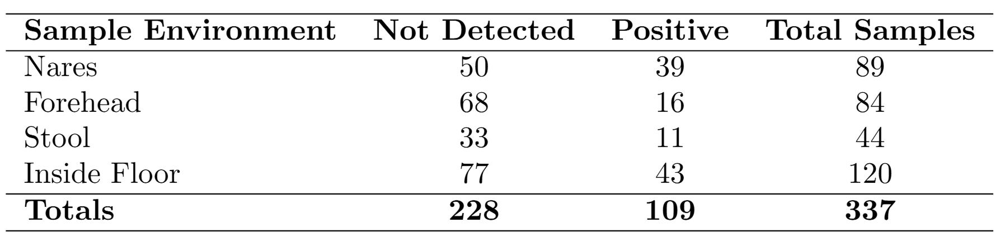

Figure 1: The counts of COVID-19 status across sample environments.

 
<h2><b>Methods</b></h2>

<h3>Attention All Microbes (AAM)</h3>

    The Attention All Microbes (AAM) model is an attention-based neural network designed to analyze microbial sequencing data. It better captures the contextual relationship between different parts of a DNA sequence by using attention mechanisms to capture complex patterns within microbial communities. Compared to other models, AAM outputs a sample-level embedding instead of a sequence-level embedding.
      
    The sample-level embeddings help to reduce the influence of sequencing noise and sample variability. This “denoising” effect ensures that the latent representation reflects genuine microbial signatures, which can be crucial when relating microbiome profiles to COVID-19 outcomes. These embeddings are subsequently used as input features for downstream machine learning models. By combining the latent features extracted by AAM with clinical and demographic data, we aim to enhance the predictive performance of COVID-19 status models. We used a baseline keras model that was developed by the creator of AAM, Kalen Cantrell,  and trained it on 80% of the data and made predictions on the remaining 20%. Using these embeddings, we hope to be able to predict and classify the COVID status of individuals based on their microbial data.

  
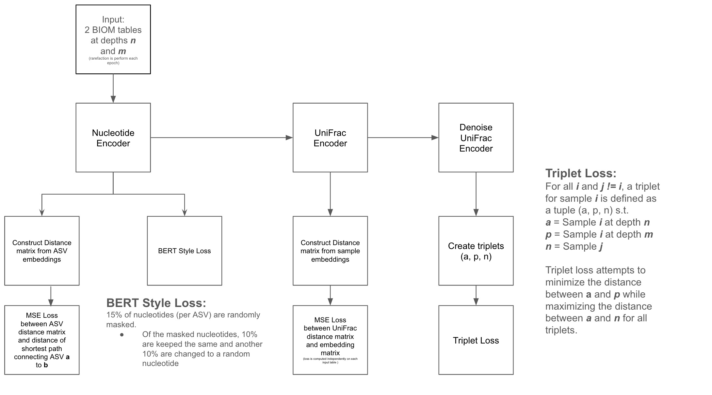

Figure 2: Architecture of AAM

  
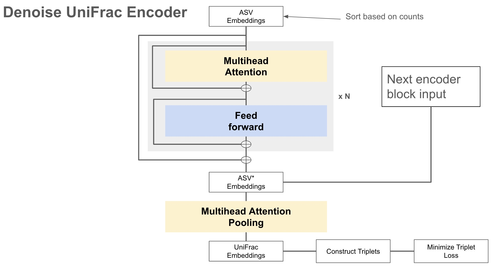

Figure 3: Architecture of Denoise UniFrac Encoder

  

<h3>DNABERT</h3>

    DNABERT builds on BERT by adapting the transformer architecture for DNA sequences. The use of BERT relates to natural language processing tasks. For instance, BERT is used for sentiment analysis and text summarization. DNABERT, on the other hand, relates more to medical use, particularly bioinformatics. The model is used to find important patterns in DNA sequences and analyze the relationship within its context. Due to their application differences, there is a significant contrast between the two models that are relevant to our experiment of working with microbiome data:
    <ul>
      <li>Training data: DNABERT was specifically trained on the human genome.</li>
      <li>Tokenization: DNABERT tokenizes sequences with k-mer representation, with each different $k$ leading to a different tokenization of a DNA sequence.</li>
      <li>Embedding type: DNABERT uses position embeddings to account for the structure of the sequences as it introduces a 512 base pair limitation.</li>
    </ul>
    We leveraged the pre-trained DNABERT model available on HuggingFace for k-mer 5. ASVs were individually inputted in the model and we extracted the hidden states as output. Then, the hidden states were mean-pooled to acquire final model embeddings at the sequence-level.

  

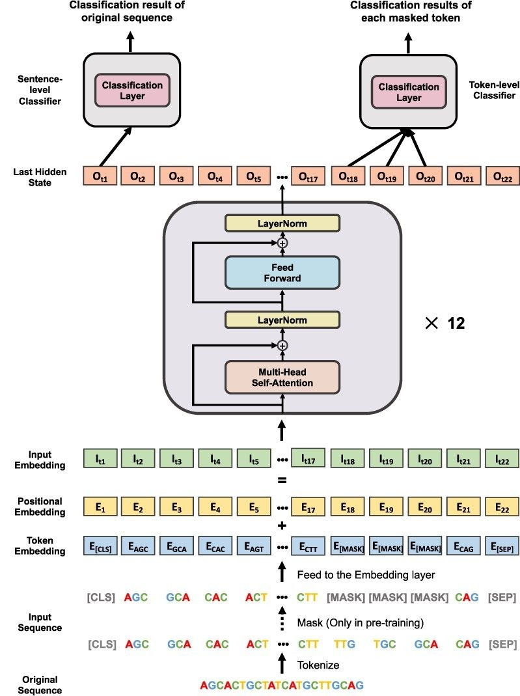

Figure 4: Architecture of DNABERT (Used only the original sequence up to the last hidden
state)

  

<h3>DNABERT-2</h3>

    DNABERT-2 improves on its predecessor, DNABERT, by addressing sequence length and training limitations as well as increasing the scope of the data. The model achieves higher performance than the original in six out of seven different tasks which include epigenetic marks prediction, transcription factor prediction on both human and mouse genome, covid variants classification, promoter detection and splice site prediction. The architecture is similar to DNABERT's (Fig. 3), but DNABERT-2 has three major changes that are relevant to our experiments:
    <ul>
      <li>Training data: DNABERT-2 is trained on multi-species genomes in addition to the human genome.</li>
      <li>Tokenization: DNABERT-2 replaces k-mer tokenization with Byte Pair Encoding (BPE) to prevent information leakage.</li>
      <li>Embedding type: DNABERT-2 uses Attention with Linear Biases (ALiBi) instead of positional embeddings like DNABERT. Positional embeddings introduce a 512 base pair limitation, but by using ALiBi instead, this limitation is eliminated.</li>
    </ul>
    We leveraged the pre-trained DNABERT-2 model available on HuggingFace. ASVs were individually inputted in the model and we extracted the hidden states as output. Then, the hidden states were mean-pooled to acquire final model embeddings at the sequence-level.

 

<h3>GROVER</h3>

    GROVER is a foundation language model that adapted the transformer encoder BERT architecture. Unlike DNABERT and DNABERT-2, which were pre-trained for classification tasks, GROVER was built for general genome modeling and can be fine-tuned for other various tasks such as CTCF motif binding, promoter classification, etc. Also, in addition to BPE-generated vocabulary, GROVER incorporates five special tokens commonly used in transformer-based language models.
    <ul>
      <li>Five Special Token Representations:
        <ul>
          <li>CLS - Classification token</li>
          <li>PAD - Ensures uniform sequence length during batching</li>
          <li>UNK - Represents unknown tokens outside vocabulary</li>
          <li>SEP - Used to indicate end of sequence</li>
          <li>MASK - Masked tokens</li>
        </ul>
      </li>
      <li>Training data: GROVER was exclusively trained on the human genome (hg19).</li>
      <li>Tokenization: Like DNABERT-2, GROVER also employs BPE, which constructs a vocabulary optimized for genome sequences. BPE helps mitigate frequency imbalance regarding genomic k-mers and allows for a more flexible and informative representation of DNA sequences.</li>
      <li>Training objective: GROVER was trained for masked token prediction, but could easily be fine-tuned.</li>
    </ul>
    We used the pre-trained GROVER model available on HuggingFace. Acquiring the final model embeddings at the sequence level is identical to DNABERT-2.

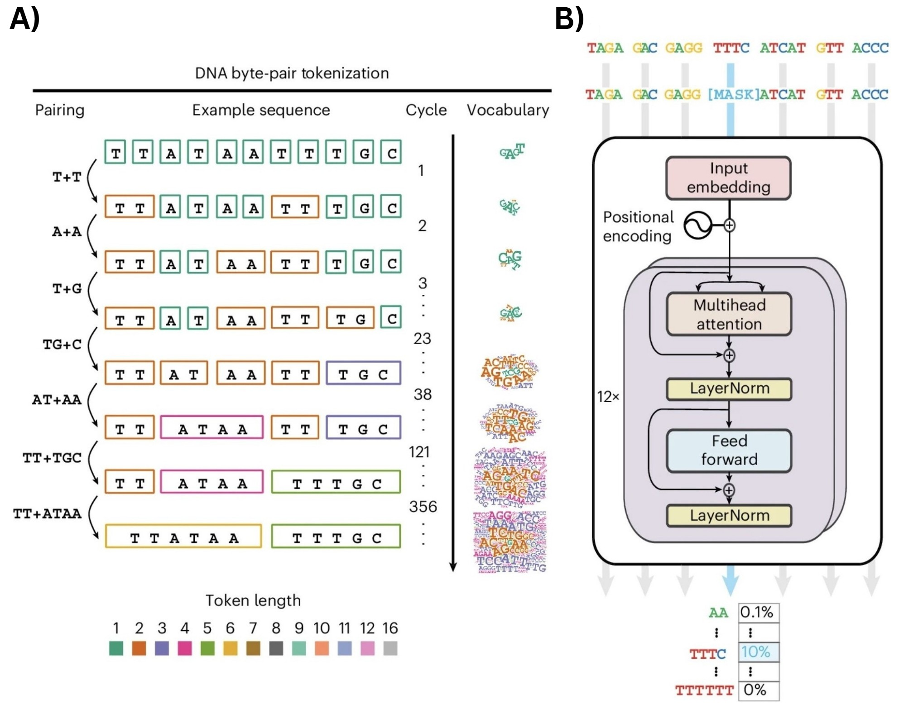

Figure 5: (A) Byte Pair Encoding (BPE) and (B) Architecture of GROVER

  

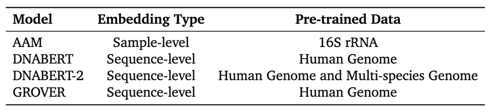

Figure 6: Our four large language models differ in their embedding type and the data they are pre-trained on.

  

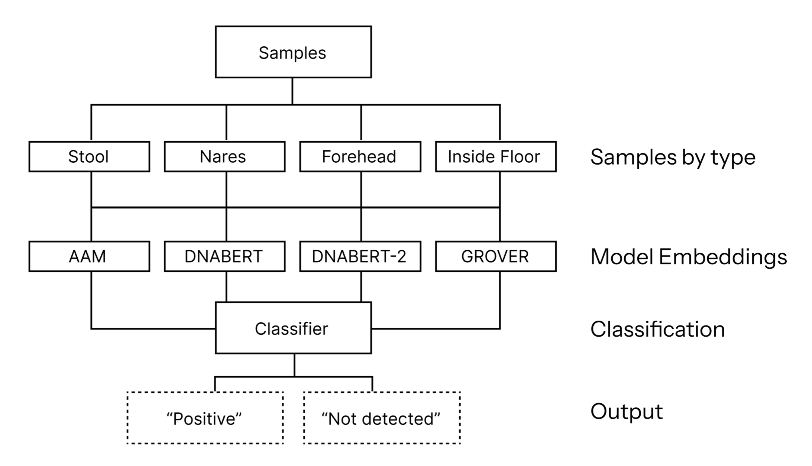

Figure 7: Samples are categorized into four environment types, with each subset split 80:20 into training and test sets. Each environment type is processed separately through the LLMs to acquire embeddings. The embeddings are passed individually through a classifier to be labeled as “Positive” or “Not detected”.

 
<h3>Model Pipeline</h3>

  We evaluated four models—AAM, DNABERT, DNABERT-2 and GROVER—by performing machine learning analysis on 16S rRNA gene amplicon sequencing data from multiple sample types (forehead, inside floor, nares and stool) to predict SARS-CoV-2 status (positive or not detected) based on RT-qPCR results.
    
  For each sample type, a SequenceRegressor sample classifier was trained on ASV-level bacterial profiles using stratified 5-fold cross-validation with optimized hyperparameters. The hyperparameters—learning rate, beta 1, beta 2 and weight decay—were tuned using the Keras Tuner module with the AdamW optimizer. We selected AdamW over standard Adam due to its improved generalization ability, as it decouples weight decay from the optimization process, leading to better convergence and reduced overfitting—particularly beneficial for high-dimensional microbiome data.
    
  ASV embeddings and IDs were extracted for each model to construct the training, validation and test datasets. Each dataset was split 80/20 for training and testing, with the training set further divided into an 80/20 split for training and validation during each fold iteration.
    
  Model performance was assessed using area under the receiver operating characteristic curve (AUROC) and area under the precision-recall curve (AUPRC), computed with the sklearn package. To ensure reproducibility, we generated 69 different test datasets, as this was the maximum number of iterations feasible given the computational constraints of our NVIDIA 2080 Ti GPU. Each dataset was seeded to maintain consistency.

 

<h2><b>Results</b></h2>
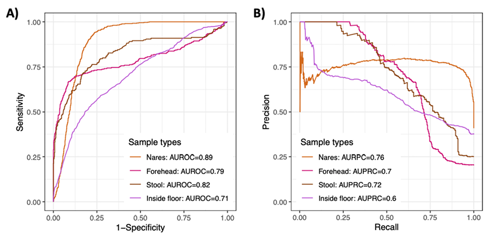

Figure 8: The prediction performance of Random Forest classifiers on SARS-CoV-2 status
was assessed using (A) AUROC and (B) AUPRC <a href="#Marotz2020">(Marotz et al. 2020)</a>.

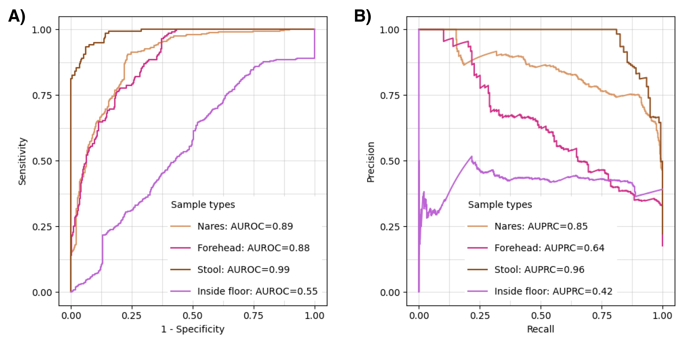

Figure 9: The prediction performance of AAM classifiers on SARS-CoV-2 status
was assessed using (A) AUROC and (B) AUPRC.

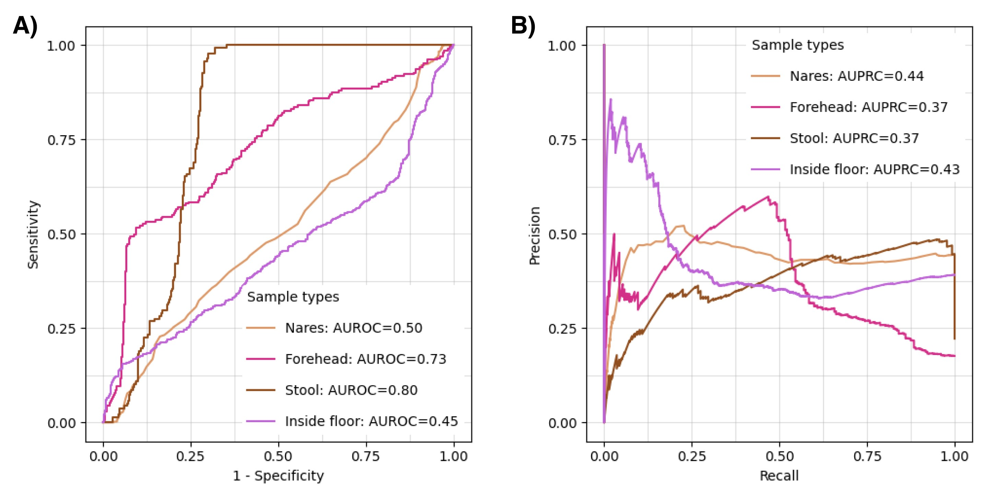

Figure 10: The prediction performance of DNABERT classifiers on SARS-CoV-2 status
was assessed using (A) AUROC and (B) AUPRC.

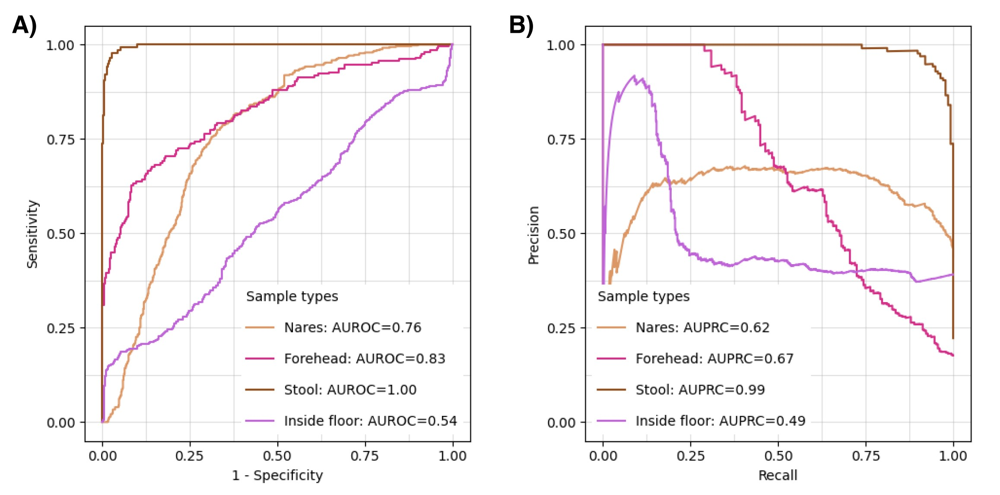

Figure 11: The prediction performance of DNABERT-2 classifiers on SARS-CoV-2 status
was assessed using (A) AUROC and (B) AUPRC.

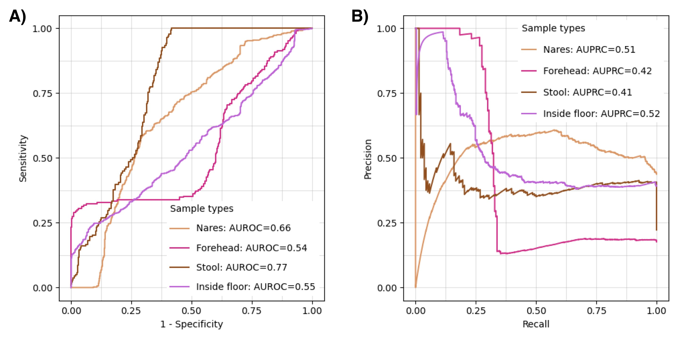

Figure 12: The prediction performance of GROVER classifiers on SARS-CoV-2 status
was assessed using (A) AUROC and (B) AUPRC.

 
<h2><b>Discussion</b></h2>

  Our results indicated that among the four tested models, AAM consistently outperformed the others in microbiome-based classification tasks. This performance may have been due to AAM’s pre-training strategy on 16S microbiome data, which aligned with the dataset we used in this study. In contrast, DNABERT, DNABERT-2 and GROVER, which were pre-trained on broader genomic sequences, showed lower performance likely due to the lack of direct pre-training on 16S sequences. However, when comparing only the three models, DNABERT-2 outperformed the others by a significant margin. This suggests that pre-training on diverse, multi-species genome data may have positively impacted a model's effectiveness in classification tasks.
    
  When comparing our findings to the original study, AAM still outperformed traditional Random Forest when considering AUROC and AUPRC scores across most sample types, except for the inside floor samples. This disparity may have been due to class imbalance, as the inside floor samples contained a significantly higher number of negatives compared to positive cases. The overall lower AUPRC scores indicated a high number of false positives, which aligned with the challenge of handling imbalanced datasets. While false positives may have been preferable to false negatives in certain classification tasks, this imbalance needed to be addressed in order to enhance model reliability and performance.
    
  There were several limitations that may have impacted our results. Firstly, the dataset we used was relatively small and highly imbalanced in some sample types, affecting model training and evaluation metrics. Additionally, the hospital-derived microbiome data used in this study may not have translated well to broader populations, introducing potential bias(es). Future work should focus on training and testing with larger, more balanced datasets while also incorporating more diverse microbiome sources to assess and improve model robustness and generalizability.
    
  The implications of using LLMs for microbiome classification are notable. Our findings suggested that LLM-based approaches, particularly when pre-trained on relevant microbiome data, could outperform traditional machine learning methods like Random Forest. However, challenges or limitations such as dataset bias, class imbalance and overall generalizability needed to be addressed to maximize the potential of these transformer-based models. As LLMs continue to develop and advance, they offer promising potential to enhance COVID-19  and possibly other disease detection using microbiome data.

 
<h2><b>References</b></h2>
<ul>
  <li id="anibal2024omicron">Anibal, J. T., et al. (2024). Omicron detection with large language models and YouTube audio data. <i>MedRxiv.</i></li>
  <li id="banerjee2023llm">Banerjee, S., et al. (2023). Large language modeling and classical AI methods for the future of healthcare. <i>Journal of Medicine, Surgery, and Public Health, 1,</i> 100026. <a href="https://doi.org/10.1016/j.glmedi.2023.100026">https://doi.org/10.1016/j.glmedi.2023.100026</a></li>
  <li id="banik2024chatgpt">Banik, D., et al. (2024). Systematic exploration and in-depth analysis of ChatGPT architectures progression. <i>Artificial Intelligence Review, 57.</i> <a href="https://doi.org/10.1007/s10462-024-10832-0">https://doi.org/10.1007/s10462-024-10832-0</a></li>
  <li id="Bao2024">Bao, Z., et al. (2024). Predicting host health status through an integrated machine learning framework. <i>Scientific Reports, 14,</i> 31143. <a href="https://doi.org/10.1038/s41598-024-82418-3">https://doi.org/10.1038/s41598-024-82418-3</a></li>
  <li id="cantrell2025microbes">Cantrell, K. W. (2025). Attention All Microbes. <a href="https://github.com/kwcantrell/attention-all-microbes/tree/capstone-2025">GitHub Repository</a></li>
  <li id="CentersforDiseaseControlandPrevention_2024">Centers for Disease Control and Prevention. (2024, July). COVID-19 Timeline. <a href="https://www.cdc.gov/museum/timeline/covid19.html#">https://www.cdc.gov/museum/timeline/covid19.html#</a></li>
  <li id="devlin2018bert">Devlin, J., et al. (2018). BERT: Pre-training of Deep Bidirectional Transformers for Language Understanding. <i>CoRR, abs/1810.04805.</i> <a href="http://arxiv.org/abs/1810.04805">http://arxiv.org/abs/1810.04805</a></li>
  <li id="Farhat2023">Farhat, F., et al. (2023). COVID-19 and beyond: leveraging AI for enhanced outbreak control. <i>Frontiers in Artificial Intelligence, 6,</i> 1266560. <a href="https://doi.org/10.3389/frai.2023.1266560">https://doi.org/10.3389/frai.2023.1266560</a></li>
  <li id="feng2025carbon">Feng, Z., et al. (2025). Implementing a universal carbon emissions prediction model. <i>Applied Energy, 383,</i> 125372. <a href="https://doi.org/10.1016/j.apenergy.2025.125372">https://doi.org/10.1016/j.apenergy.2025.125372</a></li>
  <li id="gonzalez2018qiita">Gonzalez, A., et al. (2018). Qiita: rapid, web-enabled microbiome meta-analysis. <i>Nature Methods, 15(10),</i> 796–798.</li>
  <li id="HernandezMedina2022">Hernández Medina, R., et al. (2022). Machine learning in microbiome research. <i>ISME Communications, 2,</i> 98. <a href="https://doi.org/10.1038/s43705-022-00182-9">https://doi.org/10.1038/s43705-022-00182-9</a></li>
  <li id="ji2021dnabert">Ji, Y., et al. (2021). DNABERT: pre-trained BERT for DNA-language in genome. <i>Bioinformatics, 37(15),</i> 2112–2120. <a href="https://doi.org/10.1093/bioinformatics/btab083">https://doi.org/10.1093/bioinformatics/btab083</a></li>
  <li id="liu2023chatgpt">Liu, Y., et al. (2023). Summary of ChatGPT-Related research. <i>Meta-Radiology, 1(2),</i> 100017. <a href="https://doi.org/10.1016/j.metrad.2023.100017">https://doi.org/10.1016/j.metrad.2023.100017</a></li>
  <li id="Markov2023">Markov, P. V., et al. (2023). The evolution of SARS-CoV-2. <i>Nature Reviews Microbiology, 21,</i> 361–379. <a href="https://doi.org/10.1038/s41579-023-00878-2">https://doi.org/10.1038/s41579-023-00878-2</a></li>
  <li id="Marotz2020">Marotz, C., et al. (2020). Microbial context predicts SARS-CoV-2 prevalence. <i>MedRxiv.</i> <a href="https://doi.org/10.1101/2020.11.19.20234229">https://doi.org/10.1101/2020.11.19.20234229</a></li>
  <li id="mcdonald2012biom">McDonald, D., et al. (2012). The Biological Observation Matrix (BIOM) format. <i>Gigascience, 1(1),</i> 2047-217X.</li>
  <li id="Patil2023">Patil, S., et al. (2023). Forecasting COVID-19 cases using Transformer models. <i>MedRxiv.</i> <a href="https://doi.org/10.1101/2023.11.02.23297976">https://doi.org/10.1101/2023.11.02.23297976</a></li>
  <li id="sanabria2024dna">Sanabria, M., et al. (2024). DNA language model GROVER. <i>Nature Machine Intelligence, 6(8),</i> 911–923.</li>
  <li id="Toloka">Toloka AI. (n.d.). History of LLMs. <a href="https://toloka.ai/blog/history-of-llms/">https://toloka.ai/blog/history-of-llms/</a></li>
  <li id="Yeoh2021">Yeoh, Y. K., et al. (2021). Gut microbiota and COVID-19. <i>Gut, 70(4),</i> 698–706. <a href="https://doi.org/10.1136/gutjnl-2020-323020">https://doi.org/10.1136/gutjnl-2020-323020</a></li>
  <li id="zhao2024finance">Zhao, H., et al. (2024). Revolutionizing Finance with LLMs. <a href="https://arxiv.org/abs/2401.11641">https://arxiv.org/abs/2401.11641</a></li>
  <li id="zhou2023dnabert">Zhou, Z., et al. (2023). Dnabert-2: Efficient foundation model. <i>ArXiv Preprint.</i></li>
  <li id="zvyagin2023genslms">Zvyagin, M., et al. (2023). GenSLMs: Genome-scale language models. <i>Int. J. High Perf. Comp. Apps, 37(6),</i> 683–705.</li>
</ul>
 

<h2><b>Appendices</b></h2>
<h3>Additional Figures</h3>
<iframe class="empress" src="assets/aam_empress_tree.svg" width="auto" height="360" frameBorder=0></iframe>

Figure A 1: Empress Tree of AAM stool data

<iframe class="empress" src="assets/dnabert_empress_tree.svg" width="auto" height="360" frameBorder=0></iframe>

Figure A 2: Empress Tree of DNABERT stool data

<iframe class="empress" src="assets/dnabert_2_empress_tree.svg" width="auto" height="360" frameBorder=0></iframe>

Figure A 3: Empress Tree of DNABERT-2 stool data

<iframe class="empress" src="assets/grover_empress_tree.svg" width="auto" height="360" frameBorder=0></iframe>

Figure A 4: Empress Tree of GROVER stool data

